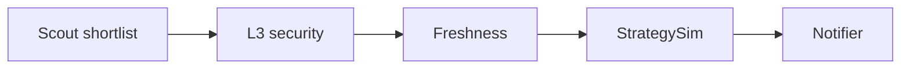

# Plan: Strategy Simulator v1 (Simulation-Only, Risk-First)

This plan is designed to be executable by implementation mode without changing core scheduler/fail-fast invariants.

## 0) Architecture at a glance

Key invariant (risk-first): StrategySim must never silently upgrade a candidate into actionable.

---

## 1) Output storage decision (v1)

Constraint: current report carrier is ScoutResult.metadata as dict[str,str].

Decision (recommended): store StrategySim output as flat string keys with prefix sim_.

Rationale:
- minimal blast radius
- no refactor of models/history pipelines
- aligns with existing freshness metadata wiring

---

## 2) Data Contract v1 (metadata keys)

Mandatory keys (per reported candidate):
- sim_status: OK | PARTIAL | UNSUPPORTED
- sim_best_strategy: strategy id
- sim_fit_score: 0..100
- sim_exp_net_apy_min: float
- sim_exp_net_apy_max: float
- sim_risk_score: 0..100
- sim_constraints_hit: csv, stable order
- sim_required_data_missing: csv, stable order

Optional convenience:
- sim_candidates_compact: short summary list, e.g. id:fit:risk

Formatting rules:
- values stored as strings
- csv lists are comma-separated, no spaces
- floats formatted with 2 decimals

---

## 3) Strategy catalog v1 (supported + matchers)

Use these IDs:
- liquid_staking_core
- single_sided_lending
- yield_bearing_stable_core
- stable_stable_fee_capture
- clmm_range_harvest

Inputs available today:
- candidate chain, symbol, project, reward tokens, TVL, APY components
- risk policy metadata: stable tier, pair_currency_class, fx_exposure
- freshness metadata: freshness_status, divergence

Matcher principle (v1): map from candidate characteristics to a set of plausible strategies.

Proposed mapping heuristics:
- liquid_staking_core: symbol contains stETH/rETH/sfrxETH/jitoSOL/mSOL OR project is a known LST provider (start with symbol-only if we want minimal)
- single_sided_lending: project contains aave/spark/morpho and pair class is TOKEN_STABLE or USD_STABLE_STABLE where applicable
- yield_bearing_stable_core: symbol contains sUSDe/sDAI/USDe/DAI and project indicates Ethena or Spark savings
- stable_stable_fee_capture: pair_currency_class in USD_STABLE_STABLE or EUR_STABLE_STABLE or FX_STABLE
- clmm_range_harvest: project indicates uniswap v3/aerodrome/slipstream/velodrome AND presence of fee tier or concentrated liquidity tags if present (if missing -> PARTIAL)

Note: v1 may deliberately mark some strategies PARTIAL due to missing data.

---

## 4) Deterministic simulation rules (engine)

### 4.1 Inputs

Simulation should use only:
- ScoutResult.net_apy as baseline gross net APY estimate
- candidate.yield_quality to reason about base vs rewards
- security bucket, freshness status, stable tier, pair class

### 4.2 Expected net APY range

Bounded heuristic example:
- exp_min = net_apy * quality_factor * safety_factor
- exp_max = net_apy * cap_factor

Where factors are deterministic from:
- yield_quality buckets
- stable tier buckets
- freshness status (unverified reduces exp_min)

### 4.3 Fit score 0..100

Compute as weighted sum:
- base feasibility (supported chain + supported pair class)
- data completeness
- risk policy compatibility
- reward quality (avoid high reward share)

### 4.4 Risk score 0..100

Deterministic, conservative:
- start at 50
- add for FX exposure, T3 stable tier, high reward share, freshness unverified/diverged
- clamp 0..100

### 4.5 Required data missing

Hard policy for v1 (risk-first):
- If required_data_missing is non-empty for the selected best strategy, set sim_status=PARTIAL.
- If sim_status=PARTIAL, force report_group=WATCHLIST.

Example (CLMM):
- clmm_range_harvest requires volume_24h_usd or fees_24h_usd, plus an explicit CLMM marker.
- if absent -> PARTIAL and watchlist-only

---

## 5) EVM-only support gate

Rule (v1): if chain_id is None or not resolvable to known EVM chain, sim_status=UNSUPPORTED.

Non-EVM still appears as WATCHLIST if allow_unsupported_as_watchlist is true.

---

## 6) Config block (strategy_sim)

Add to scout config schema:
- strategy_sim.enabled (default false)
- strategy_sim.max_candidates
- strategy_sim.supported_tiers
- strategy_sim.allow_unsupported_as_watchlist
- strategy_sim.risk_thresholds_by_profile
- strategy_sim.min_data_completeness_pct

Back-compat: config must parse when the block is missing.

---

## 7) Pipeline wiring

Insert StrategySim after freshness policy application and before notifier:
- simulation annotates metadata
- policy gate may downgrade report_group to WATCHLIST
- no upgrades to ACTIONABLE

---

## 8) Decision gates v1

- sim_status in PARTIAL, UNSUPPORTED -> report_group forced to WATCHLIST
- sim_status=OK and sim_risk_score > threshold(profile) -> downgrade to WATCHLIST
- if sim_status=OK and sim_risk_score <= threshold(profile) -> do nothing (keep current group)

---

## 9) Observability

Per-cycle counters:
- simulated_count
- ok_count
- partial_count
- unsupported_count
- downgraded_to_watchlist_count
- best_strategy_distribution

Emit a single log line StrategySim summary similar to Freshness summary.

Add a counter (optional but recommended):
- missing_data_by_strategy (distribution)

---

## 10) Telegram/report rendering

Add compact fields to each report row:
- BestStrategy and SimStatus
- FitScore
- ExpNetAPY as min-max
- SimRisk
- MissingData as a short token list

Constraint: preserve Telegram chunking and avoid explosive line growth.

---

## 11) Tests

Unit tests:
- strategy matchers for each strategy id
- risk score bounds and monotonic penalties
- policy gate downgrades for PARTIAL/UNSUPPORTED

Integration tests:
- candidate -> metadata injected -> notifier includes new fields
- ensure actionable is not created from watchlist via simulation

---

## 12) Rollout and manual verification

Rollout:
- ship behind strategy_sim.enabled=false
- enable on VPS
- validate 3+ cycles: no runtime regressions
- verify partial/unsupported never appear as actionable
